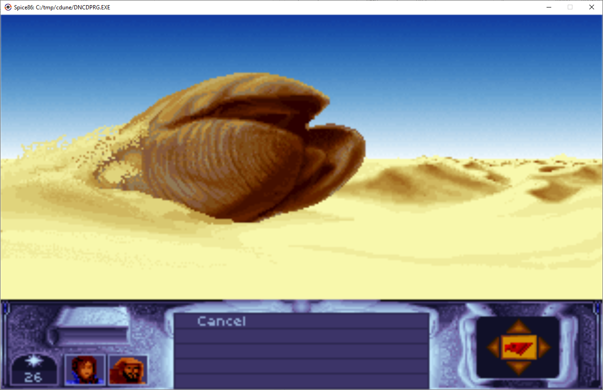

# Spice86 - An x86 emulator for spicy real mode reverse engineerings!

Spice86 is a tool to execute, reverse engineer and rewrite real mode dos programs for which source code is not available.

It requires java 17.

## Approach
Rewriting a program from only the binary is a hard task.

Spice86 is a tool that helps you do so with a methodic divide and conquer approach.

General process:
- You start by emulating the whole program in a custom VM provided by Spice86.
- This VM allows you to override bit by bit the assembly code with java functions you provide :)
- This is helpful because:
  - Small sequences of assembly can be statically analyzed and are generally easy to translate to a higher level language.
  - You work all the time with a fully working version of the program so it is relatively easy to catch mistakes early.
  - Rewriting code function by function allows you to discover the intent of the author.

## Running your exe
This is a java program, you run it with the regular java -jar command. Example with running a program called file.exe:
```
java -jar spice86.jar file.exe
```

com files and bios files are also supported.

## Dynamic analysis
Spice86 speaks the GDB remote protocol:
- it supports most of the commands you need to debug.
- it also provides custom GDB commands to do dynamic analysis. This is where the magic happens.

### Connecting
You need to specify a port for the GDB server to start when launching Spice86:
```
java -jar spice86.jar file.exe --gdbPort=10000
```

Spice86 will wait for GDB to connect before starting execution so that you can setup breakpoints and so on.

Here is then how to connect from GDB:
```
(gdb) target remote localhost:10000
```

### Vanilla GDB
You can add breakpoints, step, view memory and so on.

Example with a breakpoint on VGA VRAM writes:
```
(gdb) watch *0xA0000
```

Viewing assembly:
```
(gdb) layout asm
```

Removing a breakpoint:
```
(gdb) remove 1
```

Searching for a sequence of bytes in memory (start address 0, length F0000, ascii bytes of 'Spice86' string):
```
(gdb) find /b 0x0, 0xF0000, 0x53, 0x70, 0x69, 0x63, 0x65, 0x38, 0x36
```

GDB does not support x86 real mode segmented addressing, so pointers need to refer to the actual physical address in memory. VRAM at address A000:0000 would be 0xA0000 in GDB.

Similarly, The $pc variable in GDB will be exposed by Spice86 as the physical address pointed by CS:IP.

### Custom commands (where the magic happens)
The list of custom commands can be displayed like this:
```
(gdb) monitor help
```

#### Dump the memory to a file
```
(gdb) monitor dumpMemory path/to/dump.bin
```

DOS programs can rewrite some of their instructions / load additional modules in memory. It's a good idea to get a memory dump to see the actual assembly being executed.

#### Dump the functions
```
(gdb) monitor dumpFunctions path/to/functions.txt
```

This will dump dynamic information about the functions that have been encountered in the program you are reverse engineering. For each function:
- Their address (both in segmented and physical addressing)
- Their name if you provided an override (more about that later)
- The addresses of the returns that have been reached and their type (NEAR / FAR / INTERRUPT / MACHINE)
- The addresses of the returns that did not make the RET instruction point to the expected caller (some programs use RET as jump ...)
- The list of functions that calls it
- The list of functions it calls

Example:
```
function unknown_0x2538_0x151_0x254D1 returns:3 callers:1 called: 4 calls:3 approximateSize:11482
 - ret: FAR 0x2538:0x26AF/0x27A2F
 - ret: FAR 0x2538:0x2D41/0x280C1
 - ret: FAR 0x2538:0x2E2B/0x281AB
 - caller: unknown_0x1ED_0xC108_0xDFD8
 - call: vgaDriver.loadPalette_0x2538_0xB68_0x25EE8 overriden
 - call: vgaDriver.waitForRetraceInTransitions_0x2538_0x2572_0x278F2 overriden
 - call: unknown_0x2538_0x2596_0x27916
```

Here you can see that:
- The generated name unknown_0x2538_0x151_0x254D1 can be copy pasted directly in java to start overriding it.
- The physical address of the function is 0x254D1 in RAM (2538:0151 segmented)
- It spawns 11482 bytes (estimated distance between the entry point and the returns)
- VM encounterd several returns and it is called by one caller only
- It calls 3 other methods and 2 are overriden already

#### Special breakpoints
Break after x emulated CPU Cycles:
```
(gdb) monitor breakCycles 1000
```

Break at the end of the emulated program:
```
(gdb) monitor breakStop
```

## Detailed reverse engineering process
Concrete example with Cryo Dune [here](https://github.com/kevinferrare/cryodunere).

First run your program and make sure everything works fine in Spice86. If you encounter issues it could be due to unimplemented hardware / DOS / BIOS features.

Then run your it with the GDB server enabled and set a breakpoint on emulated program stop:
```
(gdb) monitor breakStop
(gdb) continue
```

Run some interesting actions in your emulated program and quit it from the program. If you don't have this option, you can also break after a defined number of Cycles with **breakCycles**.

When GDB gives you control due to breakpoint being reached:
- Dump the memory with **dumpMemory**
- Dump the functions with **dumpFunctions**
- Dump the java stubs with **dumpJavaStubs**

Open the functions dump file and search for an easy target. This would be ideally a small function that calls no other functions (in that case Spice86 will write overridable after the function name).

Open the memory dump in a disassembler / decompiler (I personally use [ghidra](https://github.com/NationalSecurityAgency/ghidra)) and go to the address of the function.

From there you can re-implement (override) the function and continue with the next one (see next chapter on how to do so).

## Overriding emulated code with Java code

This is where things start to get fun :)

You can provide your own Java code to override the program original assembly code.

### Defining overrides
Spice86 can take in input an instance of spice86.emulator.function.OverrideSupplier that builds a mapping between the memory address of functions and their java overrides.

Here is an example of how it would look like:
```java
package my.program;

public class MyProgramOverrideSupplier implements OverrideSupplier {
  @Override
  public Map<SegmentedAddress, FunctionInformation> generateFunctionInformations(int programStartSegment,
      Machine machine) {
    return new MyOverrides(machine).getFunctionInformations();
  }
}

class MyOverrides extends JavaOverrideHelper {
  public MyOverrides(Machine machine) {
    // "myOverides" is a prefix that will be appended to all the function names defined in this class
    super("myOverides", machine);
    // addOneToAX_0x4822_0x100_0x48320 will get executed instead of the assembly code when a call to 4822:0100 is performed.
    // Also when dumping functions, the name myOverides.addOneToAX or myOverides.clearScreen will appear instead of unknown
    defineFunction(0x4822, 0x100, "addOneToAX", this::addOneToAX_0x4822_0x100_0x48320);
    defineFunction(0x4822, 0x200, "clearScreen", this::clearScreen_0x4822_0x200_0x48420);
    // No override for function 4822:0300 but a name is provided for dumps.
    defineFunction(0x4822, 0x300, "copyScreen");
  }

  private Runnable addOneToAX_0x4822_0x100_0x48320() {
    // Assembly for this would be
    // INC AX
    // RETF
    state.setAX(state.getAX() + 1);
    // Depends on the actual return instruction performed by the function, needed to be called from the emulated code as
    // some programs like to mess with the stack ...
    return nearRet();
  }

  private Runnable clearScreen_0x4822_0x200_0x48420() {
    // A slightly more complex example, display a blank screen in VGA mode 0x13
    int vramBaseAddress = MemoryUtils.toPhysicalAddress(MemoryMap.GRAPHIC_VIDEO_MEMORY_SEGMENT, 0);
    for (int i = 0; i < 64000; i++) {
      memory.setUint8(vramBaseAddress + i, 0);
    }
    machine.getVgaCard().updateScreen();
    return farRet();
  }
}
```

### Loading overrides
Let's suppose that the overrides defined in the previous paragraph are in overrides.jar. Here is how you would launch Spice86 to use them:
```
java -cp 'overrides.jar:spice86.jar' spice86.main.Main file.exe --overrideSupplierClassName=my.program.MyProgramOverrideSupplier
```

If you just want to use the function names and not the overrides, you could add **--useCodeOverride=false** to the command line.

If you build a project around this, just call Spice86 like this in your main:
```java
  public static void main(String[] args) {
    Spice86Application.runWithOverrides(args, MyProgramOverrideSupplier.class);
  }
```
### Generating overrides
The command dumpJavaStubs generates a text file with some java stubs that could be generated automatically.
```
(gdb) monitor dumpJavaStubs path/to/stubs.txt
```

Generated stub look like this:
```java
...
// defineFunction(0x2538, 0x151, "unknown", this::unknown_0x2538_0x151_0x254D1);
public Runnable unknown_0x2538_0x151_0x254D1() {
  return farRet();
}
...
```
You can copy paste the stub to your code.

## Misc
### C Drive
It is possible to provide a C: Drive for emulated DOS functions with the option **--cDrive**. Default is current folder. For some games you may need to set the C drive to the game folder.

### Time
The emulated Timer hardware of the PC (Intel 8259) currently only supports measuring time from the number of instructions the emulated CPU did execute.

By default one second is considered to be 5 millions emulated instructions, and this can be changed with the option **--instructionsPerSecond** (adjust it to match your computer speed).

Since time depends on the number of instructions elapsed, timer ticks will become less frequent the more you re-implement your program, this may lower framerate. You can fix by decreasing instructionsPerSecond.

### Screen refresh
Screen is refreshed 60 times per emulated second and each time a VGA retrace wait is detected (see VideoBiosServicesDispatcher::tick3DA).

### VM features
CPU:
- Only 16 bits instructions are supported, memory size is 1MB
- The only supported addressing mode is real mode. 286/386 Protected mode and the related instructions are not implemented.
- Instruction set is (hopefully!) fully implemented for 8086, and validated via automated tests.
- For 80186, BOUND, ENTER and LEAVE instructions are missing.
- For 80286, instructions related to protected mode are not implemented
- For 80386, protected mode and 32 bits instructions are not implemented. FS and GS registers are supported.
- No FPU instruction implemented apart those used for FPU detection.

Graphics:
- Only VGA mode 0x13 is implemented

DOS:
- Part of int 21

Some hardware features are not emulated and missing.

### Some screenshots
Cryo dune:




Prince of persia:

